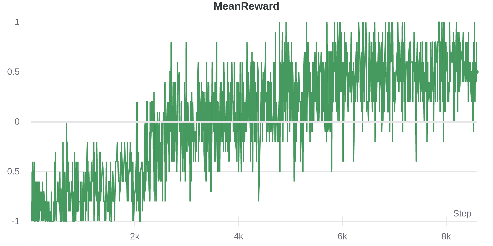

# Play Pommerman with A2C agent

Three games of pommerman

# install pommerman env
git clone https://github.com/MultiAgentLearning/playground ./pommer_setup
pip install -U ./pommer_setup
rm -rf ./pommer_setup

git clone https://github.com/RLCommunity/graphic_pomme_env ./graphic_pomme_env
pip install -U ./graphic_pomme_env
rm -rf ./graphic_pomme_env

### Install requirements
`pip install -r requirements.txt`

### Other dependencies
- maybe you need to install torch - pip3 install torch==1.8.1+cu111 torchvision==0.9.1+cu111 torchaudio==0.8.1 -f https://download.pytorch.org/whl/torch_stable.html

#### Training reward 

References:

